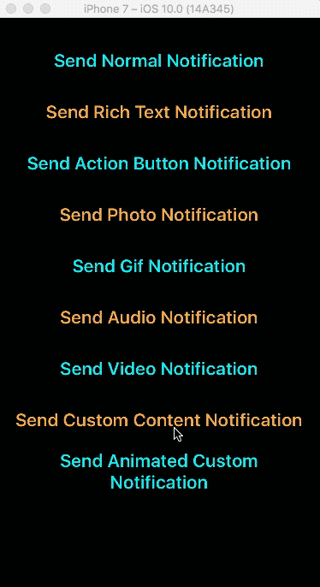
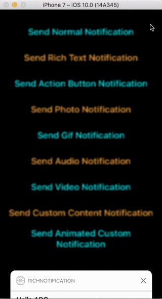

# MFNotifications
Demonstrating iOS 10 Rich Notifications with Images, Video, Gifs.
--

OS Version 
--
- iOS 10 (Some of the notifications will work on iOS 9)

How to run
--
- Update Xcode to at least 8.0
- Open project xcodeproj
- In Xcode press Cmd-R or choose Run

TODOs
--
- Currently notifications are sent via Local Notifications 
- Provide a codebase how to send Rich Notifications via Payload as Remote Notifications

Demos 
--

--

Reference : https://swifting.io/blog/2016/08/22/23-notifications-in-ios-10/
